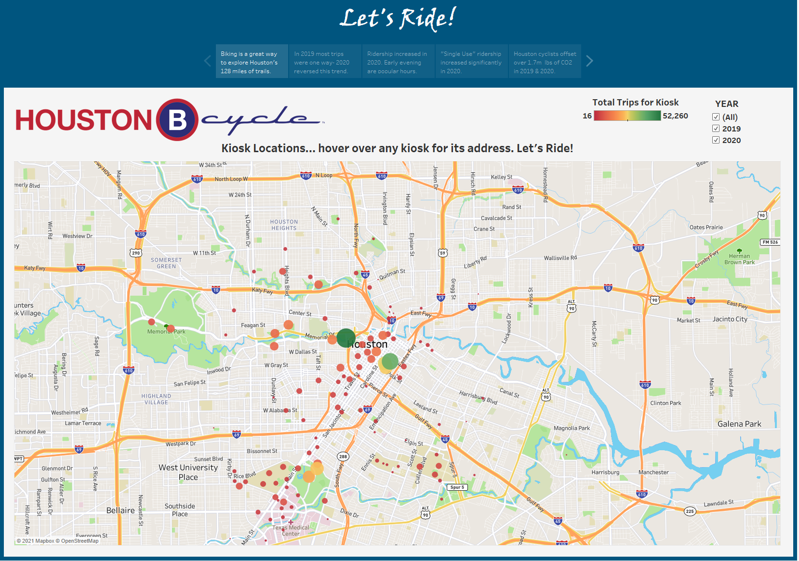
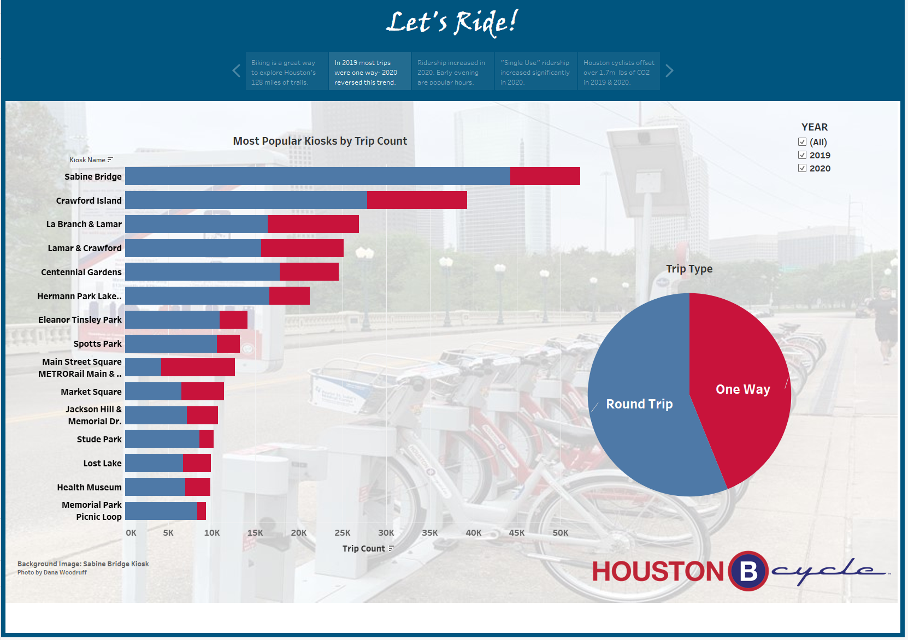
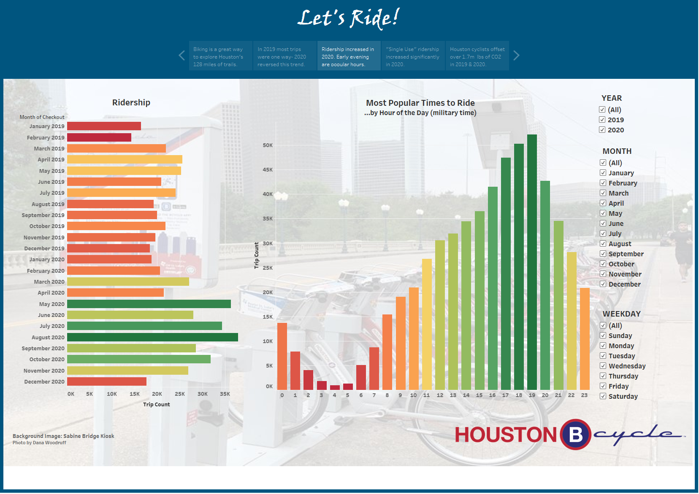
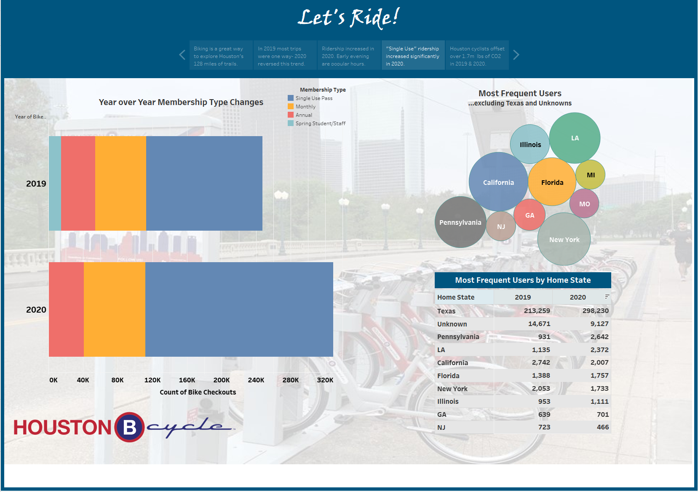
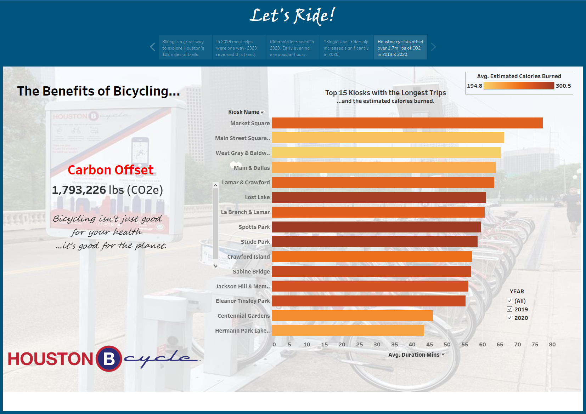

<html>

          
<body>

<h2>Houston Public Bicycle System Dashboard - with user interactivity</h2>
The project provides a visualization of the Houston Public Bicycle System data utilizing Tableau Public, Mapbox, and deployed utilizing Tableau Public at: <a href="https://public.tableau.com/profile/dana.woodruff#!/vizhome/HouBCycle/HouBcycleStory?publish=yes">Houston Bcycle Story.</a> 
 
<h3>Data</h3>
Data is gratiously sourced from <a href="https://www.houstonbcycle.com/">Houston Bcycle.</a>. Houston Bcycle also granted permission for use of their logo on the visualization dashboards and story. 
 
The data .csv file was read into Tableau after minor manipulation, e.g., columns deleted and maintenance trips deleted, to bring the file within the 100mb limit of Tableau Public. the data contains trip records for 2019 and 2020. data includes times, dates, duration, calories burned, and carbon offsets. User data include their zip codes, bike checkout kiosk and checkin kiosk. 
 
"Year" was selected as a global filter for the dashboards.
 
<h3>Dashboards and Story</h3>
Ten worksheets each have a visualization. The visualizations are brought together on five dashboards which are then presented as a story.  The main filter serves to retrieve data for each year. The story captions summarize each dashboard and guide the user through the dashboards.
 
The user is introduced to houston Bcycle with a map of stations.  Station size and color is determined by its bicycle checkout count. 
 

<kbd></kbd> 
 
Next the user explores the most popular stations and the relationship between one way and roundtrips.  The user can select one or both years.

<kbd></kbd> 
   
Ridership numbers are viewed along with the volume of riders per hour of day.  The user has filters for month and day of week on this dashboard.

<kbd></kbd> 
 
The user then explores the type of memberships are being used and how that has changed between 2019 and 2020.  Data on the user's home state is visualized.

<kbd></kbd> 
   
Houston Bcycle has estimated calories burned and carbon offset for each trip based on location and duration.  these are points of interest on how cycling benefits the rider and the planet.

<kbd></kbd> 
 

<h2>Let's ride!</h2>                       

</body>
</html>
